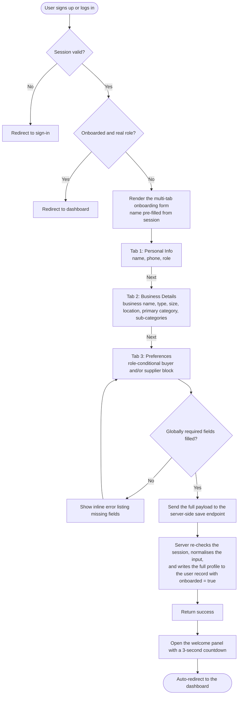

# User Onboarding — Feature Documentation

## 1. Overview

The **Onboarding** feature is the first-time profile setup flow that runs the moment a new user finishes sign-up. It is **not** a signup form — the user is already authenticated by the time they reach this page. Its job is to collect the business and behavioural context that OPTIZIVE's matching engine needs, persist it to the user profile, and then mark the user as onboarded so the rest of the app becomes reachable.

The system is split into two logical parts:

- **Entry page** — A small server-rendered route guard that decides whether to render the form, send the user to sign-in, or skip onboarding altogether.
- **Multi-tab form** — A client-side form that runs through the profile questions in three tabs, with role-conditional content and inline conversational styling. It is composed of a few small reusable pieces that render the answers inside running sentences.

The whole flow ends with a short welcome panel and an auto-redirect into the main app.

### Design note

The form is intentionally built as a **conversational, inline-style questionnaire** — one running sentence with the answers inline — rather than a traditional labelled grid. This is a UX choice to lower form fatigue on mobile and to make the questionnaire feel less like an admin form and more like a guided chat. The data structure behind it, however, is strictly typed against the platform's category and business enums, and the user record is the same regardless of how the questions are asked.

---

## 2. How the Feature Is Used

### 2.1 Entry conditions

The onboarding flow is reached automatically when a freshly signed-up user lands on it. The entry page itself decides who actually sees the form:

- If the user is **not signed in**, they are sent to the sign-in page.
- If the user is already **marked as onboarded and has a real role**, they are sent straight to the dashboard.
- Otherwise, the multi-tab form is rendered with the user's name pre-filled from the session.

In other words, the flow is **unreachable** for unauthenticated users and **skipped** for users who have already completed it. Every visit is decided by the route guard, so the user only ever sees the form once.

### 2.2 The three-step flow

The form is split into three tabs, and the user can move back and forth between them at any time. The steps are:

1. **Personal Info** — name, phone, and the role the user is joining as.
2. **Business Details** — the business identity, type, size, location, and product categories.
3. **Preferences** — a role-conditional block of buyer and/or supplier preferences.

The final step's **Complete Profile** button submits the form. On success, a small welcome panel appears and the user is automatically moved into the dashboard a few seconds later.

### 2.3 What the user provides

The user fills a multi-step questionnaire with the following groups of fields:

- **Identity and contact** — display name, phone number, and the role being joined.
- **Business identity** — business name, business type, business size, optional years in business, district, area, primary category, and optional sub-categories.
- **Buyer preferences** (for buyers and dual-role users) — monthly purchase range, pricing preference, negotiation style, buying priority, restock frequency, preferred distance, and max delivery time.
- **Supplier preferences** (for suppliers and dual-role users) — service area, service radius in kilometres, delivery method, delivery time range, pricing type, bulk discount availability, order capacity, and supplier tags.

The complete list of fields, with descriptions and downstream usage, is in §4.

---

## 3. Form Pipeline

The form is rendered as three tabs with role-conditional content. Behind the scenes, every step has the same shape: a running sentence is shown on the page, and the answers are placed inside the sentence at the relevant words. A visual stepper at the top of the form reflects the user's progress, with a completion dot on each tab whose required fields are filled.

### 3.1 Tab 1 — Personal Info

This tab captures the user's basic identity and the role they will play on the platform.

- **Name** — the user's display name, pre-filled from the session.
- **Phone** — the user's contact number, digits-only and capped at eleven characters.
- **Role** — the role being joined, chosen from *Store Owner*, *Supplier*, or *Both*. Defaults to *Store Owner*.

The **Next** button is enabled as soon as the name and phone are filled.

### 3.2 Tab 2 — Business Details

This tab captures the business identity and product focus.

- **Business name** — the display name of the business.
- **Business type** — one of ten operating models: *Retailer*, *Wholesaler*, *Manufacturer*, *Distributor*, *Importer*, *Exporter*, *Trader*, *Processor*, *Agro processor*, and *Apparel factory*.
- **Business size** — one of four scale tiers: *Small*, *Medium*, *Large*, *Enterprise*.
- **Years in business** — a numeric count of years the business has been operating. Optional.
- **Area and district** — the business location.
- **Primary category** — one of twenty-seven product lines (e.g. *Groceries*, *FMCG*, *Fresh produce*, *Electronics*, *Clothing*, *Pharmacy*, *Construction materials*, *Packaging*, *Chemicals*, *Plastics*, *Restaurant supply*, *Hospitality supply*, etc.).
- **Sub-categories** — zero or more additional product lines from the same category list, used to mark secondary product lines.

The **Next** button is enabled as soon as the business name, type, size, area, district, and primary category are all filled.

### 3.3 Tab 3 — Preferences

This tab renders one or two preference blocks depending on the chosen role. Each block is a single running sentence with the answers inline.

#### Buyer block (shown for *Store Owner* and *Both*)

The buyer block collects the user's buying profile:

- **Monthly purchase range** — one of four spend bands, from *Under 500* to *10,000+*.
- **Pricing preference** — one of four pricing tiers: *Budget*, *Value*, *Mid range*, *Premium*.
- **Negotiation preference** — one of three styles: *Flexible*, *Fixed*, *No negotiation*.
- **Buying priority** — one of five decision factors: *Low cost*, *Fast*, *Quality*, *Reliability*, *Consistency*.
- **Restock frequency** — one of four cadences: *Weekly*, *Bi-weekly*, *Monthly*, *Seasonal*.
- **Preferred distance** — one of six sourcing radii: *Neighborhood*, *Local*, *City*, *Regional*, *Nationwide*, *International*.
- **Max delivery time** — one of five delivery windows: *Same day*, *Next day*, *2-3 days*, *Within week*, *Flexible*.

#### Supplier block (shown for *Supplier* and *Both*)

The supplier block collects the user's supply-side profile:

- **Service area** — one of five coverage levels, from *Local* to *International*.
- **Service radius in kilometres** — a numeric delivery radius. Optional.
- **Delivery method** — one of five logistics modes: *Self delivery*, *Courier*, *Both*, *Pickup*, *Freight*.
- **Delivery time range** — one of five promise windows, the same options as the buyer's max delivery time.
- **Pricing type** — one of four pricing tiers, the same options as the buyer's pricing preference.
- **Bulk discount availability** — whether the supplier offers bulk pricing: *Available* or *Not available*.
- **Order capacity** — one of four scale tiers, reusing the business-size scale: *Small*, *Medium*, *Large*, *Enterprise*.
- **Supplier tags** — zero or more of twelve trust and specialty flags: *Fast delivery*, *Bulk discount*, *Premium quality*, *Low price*, *Factory direct*, *Cash on delivery*, *VAT invoice*, *Halal certified*, *BSTI certified*, *Export ready*, *Cold chain*, *Sample available*.

#### Role-conditional rendering

The two blocks are rendered independently based on the role chosen in Tab 1:

- *Store Owner* → only the buyer block.
- *Supplier* → only the supplier block.
- *Both* → both blocks, stacked, with the buyer block first and the supplier block second.

### 3.4 Validation and gating

- The **Next** button is disabled until the per-tab minimum fields are filled.
- The stepper at the top of the form shows a completion dot on each tab whose required fields are filled, so the user can see progress at a glance and jump straight to a completed tab.
- On the final tab, the **Complete Profile** button is disabled until the globally required fields across the whole form (name, phone, business name, business type, business size, district, area, primary category) are all filled. If anything is still missing when the user clicks it, a single-line error message appears listing the missing fields, and the user stays on the form.

### 3.5 Save flow

When the user clicks **Complete Profile**, the form:

1. Validates the global required fields and shows an inline error if anything is missing.
2. Coerces the numeric fields (years in business, service radius) into numbers when possible, leaving them blank otherwise.
3. Sends the full payload to a server-side save endpoint.
4. The server endpoint re-checks the session, normalises the input (trimming strings, mapping empty values to nothing, defaulting multi-value lists to empty), and writes it to the user record along with a flag that marks the user as onboarded.
5. On success, a welcome panel opens. On failure, an inline error message is shown on the form so the user can correct the values and try again.

---

## 4. Data Collected

The form gathers **26 fields** in total. They are grouped below by purpose, with the rationale and downstream usage for each. Field names are kept in their natural form so the table is easy to scan against the form.

### 4.1 Identity and Contact

| Field | Required | Description | Used later for |
|---|---|---|---|
| Name | yes | Display + identity name | Shown across chat, community posts, sales, supplier cards, and comments. |
| Phone | yes | Real contact channel, digits-only, capped at eleven characters | Verification, contact by counterparties, future SMS features. |
| Role | yes | *Store Owner*, *Supplier*, or *Both* | Drives which preference block renders, which dashboard the user lands on, permission checks, buyer↔supplier matching, hiding/showing *Sell* vs *Buy* CTAs, and role-scoped analytics. |

### 4.2 Business Identity

| Field | Required | Description | Used later for |
|---|---|---|---|
| Business name | yes | Display name of the business | Shown on listings, supplier cards, and sales invoices; turned into a shareable URL behind the scenes. |
| Business type | yes | One of ten operating models (Retailer, Wholesaler, Manufacturer, Distributor, Importer, Exporter, Trader, Processor, Agro processor, Apparel factory) | Filtering suppliers, recommending compatible counterparties, and supply-chain analytics. |
| Business size | yes | One of four scale tiers (Small, Medium, Large, Enterprise) | Pricing-tier eligibility, default for order capacity, trust score weighting. |
| Years in business | optional | A numeric count of years operating | Trust / credibility signal — feeds verification gating, average-rating context, and supplier trust badges. |
| District, area | yes | The locality where the business is based | Locality-based search, distance matching, region-specific dashboards, and future map features. |
| Primary category | yes | One of twenty-seven product lines (Groceries, FMCG, Fresh produce, Electronics, Clothing, Pharmacy, etc.) | Category-scoped feed, supplier–buyer matching, product-listing defaults. |
| Sub-categories | optional | Zero or more additional product lines from the same category list | Broader matching — when a buyer's primary category matches a supplier's sub-category, the match still surfaces. |

### 4.3 Buyer Preferences (shown for *Store Owner* and *Both*)

| Field | Required | Description | Used later for |
|---|---|---|---|
| Monthly purchase range | optional | One of four spend bands (Under 500, 500–2,000, 2,000–10,000, 10,000+) | Buyer spend tiering, recommended supplier scale, credit / payment-term hints. |
| Pricing preference | optional | One of four pricing tiers (Budget, Value, Mid range, Premium) | Matched against the supplier's pricing type, filter feed by price band. |
| Negotiation preference | optional | One of three styles (Flexible, Fixed, No negotiation) | Pre-filter suppliers who allow negotiation, surface chat UX cues. |
| Buying priority | optional | One of five decision factors (Low cost, Fast, Quality, Reliability, Consistency) | Heavily weighted in match scoring — the buyer's #1 decision factor. |
| Restock frequency | optional | One of four cadences (Weekly, Bi-weekly, Monthly, Seasonal) | Predictive restock reminders and smart-basket recommendations. |
| Preferred distance | optional | One of six sourcing radii (Neighborhood, Local, City, Regional, Nationwide, International) | Geographic filter when showing suppliers. |
| Max delivery time | optional | One of five delivery windows (Same day, Next day, 2–3 days, Within week, Flexible) | Hard filter — suppliers with slower delivery windows are de-prioritised. |

### 4.4 Supplier Preferences (shown for *Supplier* and *Both*)

| Field | Required | Description | Used later for |
|---|---|---|---|
| Service area | optional | One of five coverage levels (Local, City, Regional, Nationwide, International) | Reverse-geographic filter for matching buyers. |
| Service radius in km | optional | A numeric delivery radius in kilometres | Map-based radius matching and precise locality filter. |
| Delivery method | optional | One of five logistics modes (Self delivery, Courier, Both, Pickup, Freight) | Filtered by buyer preference (for example *I want pickup*). |
| Delivery time range | optional | One of five promise windows, the same options as the buyer's max delivery time | Filtered against the buyer's max delivery time. |
| Pricing type | optional | One of four pricing tiers, the same options as the buyer's pricing preference | Matched against the buyer's pricing preference. |
| Bulk discount availability | optional | Whether the supplier offers bulk pricing | Buyer-side filter *show me only bulk-discount suppliers*. |
| Order capacity | optional | One of four scale tiers, reusing the business-size scale | Prevents matches that exceed the supplier's physical capacity. |
| Supplier tags | optional | Zero or more of twelve trust and specialty flags (Fast delivery, Bulk discount, Premium quality, Low price, Factory direct, Cash on delivery, VAT invoice, Halal certified, BSTI certified, Export ready, Cold chain, Sample available) | Multi-tag filtering, supplier card badges, and compliance / regulation filters (halal, BSTI, etc.). |

### 4.5 Onboarded flag

When the form is submitted successfully, the user record is also marked as **onboarded**. This flag is what the route guard uses on every visit to decide whether to show the form or send the user straight to the dashboard.

---

## 5. Welcome and Redirect

After a successful save, a small **welcome panel** appears on top of the form:

- It shows the product logo, a *Welcome aboard* headline, and a one-line confirmation message.
- Below the message is a live **countdown** that starts at three and ticks down once per second.
- When the countdown reaches zero, the user is automatically sent to the main app.

If the user clicks anywhere outside the panel, the panel closes, but the user stays on the form so they can correct the values and try again.

---

## 6. End-to-End Flow

1. The user signs up or logs in. Their session is created with the onboarded flag off and the role unset.
2. The user lands on the onboarding page. The server-side route guard checks the session and the onboarded flag.
   - If the user is not signed in, they are sent to the sign-in page.
   - If the user is already onboarded with a real role, they are sent to the dashboard.
   - Otherwise, the multi-tab form is rendered with the user's name pre-filled.
3. The user moves through the three tabs. The Next button is gated by per-tab validation, and the stepper at the top reflects each tab's completion state.
4. On the final tab, the role-conditional preference block(s) are shown. The user fills in the relevant fields and clicks **Complete Profile**.
5. The form validates the globally required fields, coerces the numeric fields into numbers, and sends the payload to the server-side save endpoint.
6. The server-side endpoint re-checks the session, normalises the input, and writes the full profile to the user record along with the onboarded flag.
7. On success, the welcome panel opens, the countdown ticks down, and the user is sent to the dashboard.
8. From here on, every subsequent visit to onboarding is short-circuited to the dashboard.

### 6.1 Workflow Diagram

Key things to read off the chart:

- The route guard sits in front of the form and decides between sign-in, dashboard, and the form.
- The three tabs are presented in order, but the user can jump back and forth.
- The preference tab is **role-conditional** — buyers see the buyer block, suppliers see the supplier block, and *Both* sees both.
- The save happens on the server after a global validation pass; the welcome panel and the dashboard redirect are the only client-side steps after that.

---

## 7. Step-by-Step Summary (Quick Read)

- Onboarding is the **first-time profile setup** that runs the moment a freshly signed-up user is ready to use the app.
- A small server-side route guard decides whether the user sees the form, is sent to sign-in, or is sent straight to the dashboard.
- The form is split into three tabs — **Personal Info**, **Business Details**, and **Preferences** — with the answers inline inside running sentences.
- The **Preferences** tab is role-conditional: buyers see the buyer block, suppliers see the supplier block, and *Both* sees both.
- 26 fields are collected in total, covering identity, contact, business identity, location, product categories, and role-specific preferences.
- The Next button is gated by per-tab validation, and the stepper at the top shows each tab's completion state.
- On the final tab, the **Complete Profile** button submits the form. The server-side endpoint re-checks the session, normalises the input, and writes the full profile to the user record with the onboarded flag set.
- On success, a welcome panel opens with a three-second countdown, then the user is auto-redirected to the dashboard.
- From here on, every visit to the onboarding page is short-circuited to the dashboard by the route guard.
