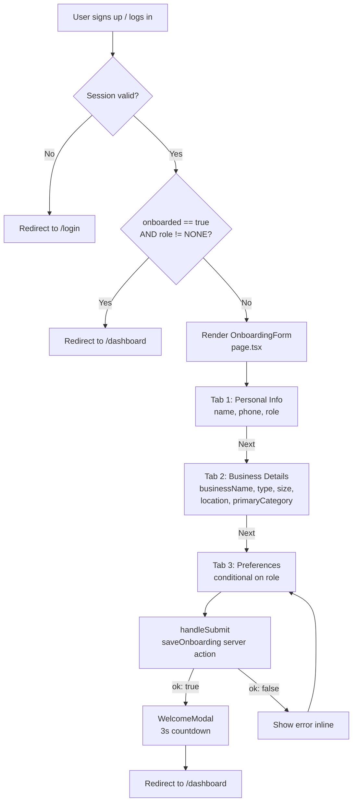
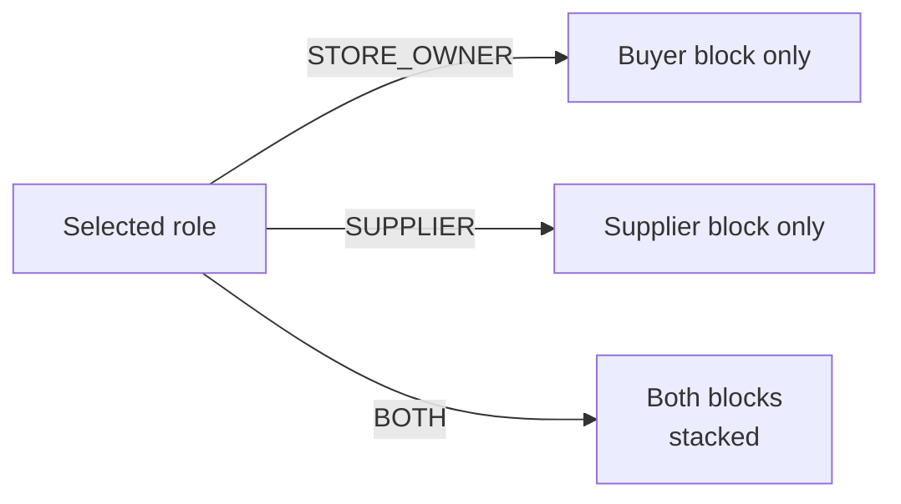
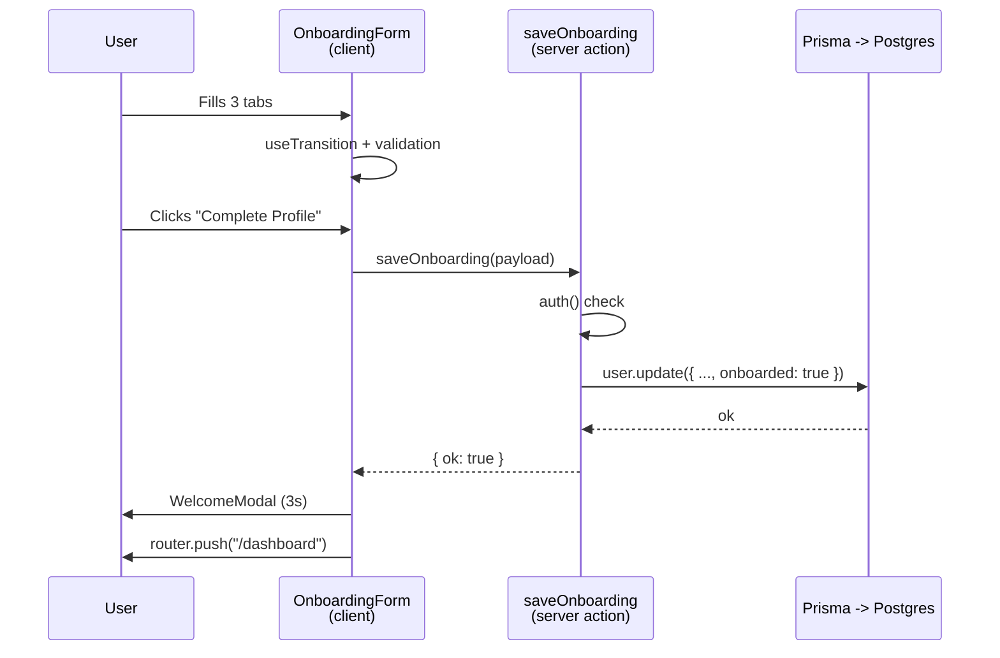

# OPTIZIVE — User Onboarding Module

> Reference document for understanding the onboarding feature, its data model, and downstream usage. Written for internal use and project-report writing.

---

## 1. Overview

The onboarding module is the **first-time profile setup flow** that runs the moment a new user finishes sign-up. It is **not** a signup form — the user is already authenticated by the time they reach this page (validated by `auth()` in `app/onboarding/page.tsx:6`).

Its single job is to:

1. Collect the **business and behavioral context** that OPTIZIVE's matching engine needs to work.
2. Persist that context to the `User` model in the database.
3. Flip the `user.onboarded` flag to `true` so the user is allowed past the route guard into the dashboard (`app/onboarding/page.tsx:12`).

### Design note

The form is intentionally built as a **conversational, inline-style questionnaire** — one running sentence with inputs and dropdowns inline — rather than a traditional labeled grid. This is a UX choice to lower form fatigue on mobile. The data structure behind it, however, is strictly typed against the Prisma enums (`app/onboarding/_components/types.ts`).

---

## 2. Route Guard & Entry Logic

File: `app/onboarding/page.tsx`

- The page is a **server component** that runs `auth()` on the server before rendering anything.
- If no session → `redirect("/login")`.
- If `session.user.onboarded` is true **and** `role` is not `NONE` → `redirect("/dashboard")`.
- Otherwise, the `<OnboardingForm>` client component is mounted with `initialName` pre-filled from the session.

This means **onboarding is unreachable** for users who haven't signed in, and **bypassed** for users who have already completed it.

---

## 3. Flow Architecture

The flow has **3 tabs** (`app/onboarding/onboarding-form.tsx:72-76`):

1. **Personal Info** — name, phone, role
2. **Business Details** — business identity, type, size, location, categories
3. **Preferences** — role-conditional buyer and/or supplier preferences

The user can jump freely between tabs. The **Next** button is gated by per-tab validation (`canProceedToNext`, `onboarding-form.tsx:91-99`), and each tab's completion state is reflected visually in the stepper (`onboarding-form.tsx:231-256`).

After a successful save, a `WelcomeModal` opens with a 3-second auto-redirect countdown to `/dashboard` (`_components/WelcomeModal.tsx:18-31`).

### 3.1 Visual flow



### 3.2 Role-based rendering in Tab 3



Logic at `onboarding-form.tsx:69-70`:

```ts
const showBuyerFields    = form.role === "STORE_OWNER" || form.role === "BOTH";
const showSupplierFields = form.role === "SUPPLIER"    || form.role === "BOTH";
```

---

## 4. Data Collected — What, Why, and How It's Used

The form gathers **23 fields** in total. They are grouped below by purpose, with the type, rationale, and downstream usage for each.

### 4.1 Identity & Contact

| Field | Type | Required | Why collected | Used later for |
|---|---|---|---|---|
| `name` | string | yes | Display + identity | Shown across chat, community posts, sales, supplier cards, comments. |
| `phone` | string, digits-only, max 11 | yes | Real contact channel | Stored unique on `User.phone` (`prisma/user.prisma:9`). Used for verification, contact by counterparties, future SMS features. |

### 4.2 Role

`role` ∈ `{STORE_OWNER, SUPPLIER, BOTH}` — required, defaults to `STORE_OWNER` (`onboarding-form.tsx:42`).

- **Why:** Drives which preference block renders in Tab 3, and which dashboard surface the user lands on.
- **Used later for:** Permission checks, buyer↔supplier matching, hiding/showing "Sell" vs "Buy" CTAs, role-scoped analytics, the `@@index([role, district, primaryCategory])` composite index on `User` (`prisma/user.prisma:89`).

### 4.3 Business Identity

| Field | Type | Why | Used later for |
|---|---|---|---|
| `businessName` | string | Display name of the business | Shown on listings, supplier cards, sales invoices. Slugged into `businessSlug` server-side for shareable URLs. |
| `businessType` | enum (10 values) | Classifies operating model — Retailer, Wholesaler, Manufacturer, Distributor, Importer, Exporter, Trader, Processor, Agro processor, Apparel factory | Filtering suppliers, recommending compatible counterparties, supply-chain analytics. Index: `@@index([businessType, businessSize])` (`prisma/user.prisma:90`). |
| `businessSize` | enum (SMALL / MEDIUM / LARGE / ENTERPRISE) | Scale signal | Pricing-tier eligibility, default for `orderCapacity`, trust score weighting. |
| `yearsInBusiness` | optional int | Trust / credibility signal | `isVerified` gating, average-rating context, supplier trust badges. |
| `district`, `area` | string | Geographic scope | Locality-based search, distance matching, region-specific dashboards, future map features. |
| `primaryCategory` | enum (27 values) | Main product/business line | Category-scoped feed, supplier-buyer matching, product listing defaults. |
| `subCategories` | string[] | Secondary product lines | Broader matching — when a buyer's primary category matches a supplier's sub-category, the match still surfaces. |

### 4.4 Buyer Preferences (shown for `STORE_OWNER` and `BOTH`)

| Field | Type | Why | Used later for |
|---|---|---|---|
| `monthlyPurchaseRange` | string (UNDER_500 / 500_2000 / 2000_10000 / 10000_PLUS) | Buyer spend capacity | Tiering, recommended supplier scale, credit/payment term hints. |
| `pricingPreference` | enum (BUDGET / VALUE / MID_RANGE / PREMIUM) | Price tier the buyer operates in | Match against supplier `pricingType`, filter feed by price band. |
| `negotiationPreference` | enum (FLEXIBLE / FIXED / NO_NEGOTIATION) | Willingness to negotiate | Pre-filter suppliers who allow negotiation, chat UX cues. |
| `buyingPriority` | enum (CHEAP / FAST / QUALITY / RELIABILITY / CONSISTENCY) | The buyer's #1 decision factor | Ranked match scoring — the matching engine weights this heavily. |
| `restockFrequency` | string (WEEKLY / BIWEEKLY / MONTHLY / SEASONAL) | Reorder cadence | Predictive restock reminders, smart-basket recommendations. |
| `preferredDistance` | enum (NEIGHBORHOOD / LOCAL / CITY / REGIONAL / NATIONWIDE / INTERNATIONAL) | Max sourcing radius | Geographic filter when showing suppliers. |
| `maxDeliveryTime` | enum (SAME_DAY / NEXT_DAY / 2-3_DAYS / WITHIN_WEEK / FLEXIBLE) | Urgency tolerance | Hard filter — suppliers with slower delivery windows are de-prioritized. |

### 4.5 Supplier Preferences (shown for `SUPPLIER` and `BOTH`)

| Field | Type | Why | Used later for |
|---|---|---|---|
| `serviceArea` | enum (LOCAL / CITY / REGIONAL / NATIONWIDE / INTERNATIONAL) | Where the supplier ships | Reverse-geographic filter for matching buyers. |
| `serviceRadiusKm` | optional int | Numeric delivery radius (km) | Map-based radius matching, precise locality filter. |
| `deliveryMethod` | enum (SELF / COURIER / BOTH / PICKUP / FREIGHT) | Logistics mode | Filtered by buyer preference (e.g. "I want pickup"). |
| `deliveryTimeRange` | enum (same options as buyer) | Promise window | Filtered against buyer's `maxDeliveryTime`. |
| `pricingType` | enum (BUDGET / VALUE / MID_RANGE / PREMIUM) | The price tier the supplier operates in | Matched against buyer's `pricingPreference`. |
| `bulkDiscountAvailable` | boolean | Whether the supplier offers bulk pricing | Buyer-side filter "show me only bulk-discount suppliers". |
| `orderCapacity` | enum (reuses BUSINESS_SIZE) | Max order size the supplier can fulfil | Prevents matches that exceed the supplier's physical capacity. |
| `supplierTags` | enum[] (12 values) | Trust + specialty flags — `FAST_DELIVERY`, `BULK_DISCOUNT`, `PREMIUM_QUALITY`, `LOW_PRICE`, `FACTORY_DIRECT`, `CASH_ON_DELIVERY`, `VAT_INVOICE`, `HALAL_CERTIFIED`, `BSTI_CERTIFIED`, `EXPORT_READY`, `COLD_CHAIN`, `SAMPLE_AVAILABLE` | Multi-tag filtering, supplier card badges, compliance/regulation filters (halal, BSTI). |


---


### 5 Data flow summary




## 6. Step-by-Step Summary

1. **User authenticates** (sign-up or login) — session is created with `onboarded: false`, `role: NONE`.
2. **User lands on `/onboarding`** — `page.tsx` (server) runs `auth()`, blocks unauthenticated users, and short-circuits already-onboarded users to the dashboard.
3. **Tab 1 — Personal Info** — user enters `name` (pre-filled from session), `phone` (digit-only, max 11), and `role` (Store Owner / Supplier / Both).
4. **Tab 2 — Business Details** — user enters `businessName`, `businessType`, `businessSize`, optional `yearsInBusiness`, `area`, `district`, `primaryCategory`, and an optional list of `subCategories`.
5. **Tab 3 — Preferences** — depending on the role, a Buyer block and/or a Supplier block is rendered. Each block collects the role-specific preference enums listed in §4.
6. **Submit** — `saveOnboarding` server action runs an `auth()` check, calls `prisma.user.update` with all 23 fields, and sets `onboarded: true`.
7. **Welcome modal** — appears with a 3-second countdown, then `router.push("/dashboard")` lands the user on the main app.
8. **From here on** — every subsequent visit to `/onboarding` is auto-redirected to `/dashboard` because the guard sees `onboarded: true`.
