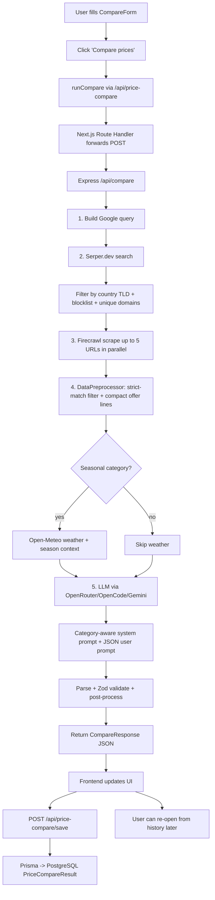

# Price Compare — Feature Documentation

## 1. Overview

The **Price Compare** feature lets a user type a product name, pick a category, and (optionally) a city + country, and get back a side-by-side view of prices, sellers, the lowest ("best") price for buyers, and a recommended price range for sellers. The whole flow is built around a small Express backend that does the actual web scraping, and a Next.js frontend that talks to it through an internal proxy.

It is split into three parts in the repo:

- **`api-express/`** — A standalone Node.js + Express + TypeScript service (deployed at `https://optizive-scrape.vercel.app`) that does the heavy lifting: search, scrape, LLM analysis.
- **`op-new/app/(user-routes)/price-compare/`** — The Next.js page (UI, state, components).
- **`op-new/backend/price-compare/price-compare.ts`** — A small client wrapper that issues the API call and returns the parsed `CompareResponse` to the React page.
- **`op-new/app/api/price-compare/`** — Next.js Route Handlers that forward the request to the external backend (`/api/compare` → `https://optizive-scrape.vercel.app/api/compare`) and persist saved comparisons via Prisma/PostgreSQL.

The frontend never talks to the Express backend directly in browser code — every request goes through a Next.js Route Handler. The handler forwards the request to the external service and, for "save" calls, performs the authenticated DB write.

---

## 2. How the API Is Used

### 2.1 What data the frontend sends

The user fills a form with these fields (see `op-new/app/(user-routes)/price-compare/_components/CompareForm.tsx`):

| Field         | Type     | Required | Example                                  |
| ------------- | -------- | -------- | ---------------------------------------- |
| `productName` | string   | yes      | `Aarong Full Cream Milk Powder 1kg`      |
| `category`    | string   | yes      | `groceries` (one of 28 enum values)      |
| `info`        | string   | no       | `1 kg pouch`                             |
| `city`        | string   | no       | `Dhaka`                                  |
| `country`     | string   | yes      | `Bangladesh` (human-readable full name)  |

These are sent in the request body as JSON (`Content-Type: application/json`) to the Next.js Route Handler, which forwards them to the Express backend.

### 2.2 Request flow

1. **User submits form** → `CompareForm` calls `handleSubmit` in `page.tsx`.
2. `page.tsx` builds a `CompareRequest` payload and calls `runCompare` (the wrapper in `op-new/backend/price-compare/price-compare.ts`).
3. The wrapper does a `POST` to `/api/price-compare` (the Next.js Route Handler).
4. The Next.js Route Handler (`op-new/app/api/price-compare/route.ts`) forwards the body to `https://optizive-scrape.vercel.app/api/compare` and returns the parsed `CompareResponse` back to the wrapper.
5. The Express backend runs the full pipeline (search → scrape → LLM) and responds with the final JSON.
6. The frontend applies the response to its state and, on success, posts the result to `/api/price-compare/save` (Next.js → Prisma → Postgres) so the user can reopen it later.

---

## 3. Backend Pipeline (Express)

The pipeline lives in `api-express/src/modules/compare/`. The full path for one request is:

```
validate body → buildSearchQuery → searchGoogleLinks → scrapePages (parallel) →
  condenseScrapedData → analyzePrices (LLM) → sanitize & respond
```

### 3.1 Query Builder — `queryBuilder.ts`

It takes the user's request and turns it into a single Google query:

```
"<productName> <info?> price <city?>, <country>"
```

Example: `Aarong Full Cream Milk Powder 1kg price Dhaka, Bangladesh`.

Important detail: it intentionally avoids words like "compare" or "cheap" — the goal is to surface real product pages, then do the comparison ourselves.

### 3.2 Google Search via Serper — `googleScraper.ts`

The backend calls the **Serper.dev** Google Search API:

- **Endpoint:** `https://google.serper.dev/search`
- **Method:** `POST`
- **Headers:** `X-API-KEY: <SERPER_API_KEY>`
- **Body:** `{ q: <query>, num: 10, gl: <country-tld> }`

How the country is used:
- A built-in `COUNTRY_TLD_MAP` converts the country name (e.g. `"Bangladesh"`) into a 2-letter TLD (`"bd"`).
- That TLD is sent as the `gl` (geolocation) hint to Serper.
- After the results come back, **every result's hostname is checked against the allowed TLD**, and any non-matching link is filtered out. This keeps results local.
- A small blocklist removes obvious non-product domains (Google, YouTube, Facebook, Wikipedia, Reddit, etc.).
- Only one link per unique domain is kept, capped at 5 links.

Output: a deduplicated, country-filtered list of product page URLs.

### 3.3 Firecrawl Web Scraping — `firecrawler.ts`

For each of the up to 5 URLs, the backend calls **Firecrawl** to extract structured product data.

- **Endpoint:** `https://api.firecrawl.dev/v1/scrape`
- **Auth:** `Authorization: Bearer <FIRECRAWL_API_KEY>`
- **Body fields used:** `url`, `formats: ['extract']`, `onlyMainContent: true`, `blockAds: true`, `proxy: 'basic'`, `timeout: 120000`, and a Firecrawl `extract` block with a custom `prompt` + `schema`.

How Firecrawl is used:
- The `extract.format` is set to `extract` so Firecrawl returns **structured JSON** (not just raw HTML/markdown).
- The extract block includes a **prompt** that tells Firecrawl's LLM what to pull (e.g. "extract ALL products visible on this page, return price as a plain number, never invent values, normalize units").
- It also includes a **strict JSON schema** that defines fields: `productName`, `brand`, `productUrl`, `imageUrl`, `availability` (`in_stock`/`out_of_stock`/null), `currency`, `price`, `originalPrice`, `discount`, `unitText`, `unitValue`, `unitName`. Extra fields are forbidden (`additionalProperties: false`).
- The backend normalizes the response: relative URLs → absolute, currency defaults to `BDT`, availability mapped to the enum, numeric prices parsed.
- **Parallel mode** is the default: URLs are round-robin distributed across Firecrawl API keys and scraped concurrently so the whole search finishes in one round trip.
- The backend can also be set to **batch mode** (sequential groups of 3 with retry-on-failure) via `FIRECRAWL_SEND_BATCH=true`.

Site metadata (favicon via `google.com/s2/favicons`, OG title, OG image) is also captured and attached to each page.

### 3.4 Data Preprocessor — `dataPreprocessor.ts`

Firecrawl's raw product list is then cleaned and condensed:

- For every scraped page, products are converted to a `ProductResult` with normalized fields (price, currency, unit, unit price, source, logo, match percentage).
- A **strict match filter** keeps only products whose name tokenizes well against the user's input. The rules are:
  - All numeric tokens (model numbers like `17`, `256`) must match exactly — this prevents `"iPhone 17"` matching `"iPhone 18"`.
  - Non-numeric tokens need at least 50% overlap (or 100% for short queries).
  - If the user filled the optional `info` field, at least one of those tokens must also match.
- A **match percentage** (40–100) is calculated: a base score from token overlap, plus a small boost if `info` tokens also match.
- The remaining products are turned into **compact one-line offer strings** of the form `product | price currency | unit`. These are the only thing the LLM sees.
- There is a hard 14,000-character cap on the LLM input — if the offers exceed it, the rest is dropped.
- If no products pass the strict filter, the first 3 products from the scrape are kept as a fallback so the user still gets something.

### 3.5 LLM Analyzer — `llmAnalyzer.ts` and `llmCategoryPrompts.ts`

This is the brain of the feature. It takes the compact offer lines and produces the pricing guidance shown to the user.

- **LLM providers:** the backend can call any of three providers, picked at runtime:
  - `AI_USE=1` (default) — **OpenRouter** with the model set in `OPENROUTER_MODEL` (uses `OPENROUTER_API_KEY`).
  - `AI_USE=2` — **OpenCode** (model `nemotron-3-super-free` by default, `OPENCODE_KEY`).
  - `AI_USE=3` — **Gemini** (model `gemini-2.0-flash` by default, `GEMINI_API_KEY`).
  - All providers are called with `temperature: 0.05` and `response_format: { type: "json_object" }` for stable, deterministic JSON.
- The LLM is given a **category-aware system prompt** and a **structured user prompt**.

#### Category-aware prompts (`llmCategoryPrompts.ts`)

There are **28 product categories** in the enum, each with its own system prompt. A generic fallback is used for anything else. Some examples:

| Category key            | Has special prompt? | Seasonal-sensitive? | Focus                                                                |
| ----------------------- | ------------------- | ------------------- | -------------------------------------------------------------------- |
| `groceries`             | yes                 | yes                 | cut/prep, freshness, unit normalization, channel costs                |
| `electronics`           | yes                 | no                  | specs, warranty, import vs grey market                               |
| `raw_materials`         | yes                 | yes                 | grade, bulk sizing, per-unit normalization                           |
| `clothing`              | yes                 | yes                 | material, brand tier, seasonal markdowns                             |
| `home_appliances`       | yes                 | yes                 | capacity, energy, warranty                                           |
| `beauty_personal_care`  | yes                 | no                  | authenticity, size normalization                                     |
| `health_pharmacy`       | yes                 | no                  | dosage, pack size, per-unit                                          |
| `baby_kids`             | yes                 | no                  | safety, size, per-unit                                               |
| `books_stationery`      | yes                 | yes                 | edition, bundle, academic season                                     |
| `sports_outdoors`       | yes                 | yes                 | material, season/event spikes                                        |
| `tools_hardware`        | yes                 | no                  | durability, brand, set vs single                                     |
| `automotive`            | yes                 | no                  | compatibility, OEM vs aftermarket                                     |
| `furniture_home`        | yes                 | no                  | material, size, delivery                                             |
| `pet_supplies`          | yes                 | no                  | nutrition, size, brand trust                                         |
| `office_supplies`       | yes                 | no                  | pack size, B2B bulk                                                  |
| `services`              | yes                 | no                  | duration, scope, quality tier                                        |
| `electronics_accessories` | yes               | no                  | compatibility, OEM vs third-party                                    |
| `mobiles_computing`     | yes                 | no                  | specs, variant, warranty, region lock                                |
| `kitchen_dining`        | yes                 | no                  | material, set count, durability                                      |
| `gifts_crafts`          | yes                 | yes                 | customization, festivals, seasonal                                   |
| `travel_luggage`        | yes                 | yes                 | size, durability, brand                                              |
| `garden_farm`           | yes                 | yes                 | pack size, planting season                                           |
| `toys_games`            | yes                 | yes                 | age range, safety, licensing                                         |
| `jewelry_watches`       | yes                 | yes                 | material, purity, authenticity                                       |
| `music_instruments`     | yes                 | no                  | brand, condition, accessories                                        |
| `industrial_equipment`  | yes                 | no                  | capacity, service contracts                                          |
| `software_digital`      | yes                 | no                  | licensing, seats, compliance                                         |
| `education_training`    | yes                 | yes                 | duration, certification, per-hour pricing                           |

The full system prompt (built by `buildCompareAnalyzerSystemPrompt`) wraps the category prompt with strict rules:

- The LLM is told to **only output valid JSON** with exactly four keys: `sellerPrice`, `bestPrice`, `summary`, `sellerSummary`.
- `sellerPrice` is always a **range** in `"MIN-MAX CURRENCY"` or `"MIN-MAX CURRENCY/UNIT"` format.
- `bestPrice` is the lowest offer with the same unit.
- `summary` (3–5 sentences) covers product overview, price distribution, market clustering, units, and (for seasonal categories) seasonal/weather factors.
- `sellerSummary` (3–5 sentences) covers pricing strategy (fast sale vs premium), profit-vs-speed tradeoff, market positioning, and risk factors.
- **MRP / fixed-price categories** (electronics, mobiles, appliances, pharmacy, books, branded goods) keep `sellerPrice` at or above the credible market price with a narrow ±2–5% band.
- **Variable-price categories** (groceries, raw materials, garden, clothing, gifts) allow a sharper floor and a 75th-percentile cap.
- If the category is **seasonal-sensitive**, the prompt also includes live **weather** and **season** context (see below). If not, the LLM is explicitly told to ignore weather/season.

#### Weather & season enrichment

For seasonal-sensitive categories, the backend:

- Calls the **Open-Meteo geocoding + forecast API** to get the current temperature and conditions for the user's city/country.
- Computes the current **season** (`winter`/`spring`/`summer`/`autumn`) from the latitude and UTC month (meteorological seasons; southern hemisphere flipped).
- Injects `{ weather, seasonal, nowUtc, categoryContextPolicy }` into the JSON user prompt so the LLM can reason about things like "winter is coming, AC prices usually drop".

The LLM still never *invents* numbers — it uses these signals only as a soft adjustment on top of the offers it already saw.

#### Post-processing of the LLM output

The LLM's JSON is validated with a Zod schema, then post-processed:

- Products are split into **exact matches** (every original word present) and **related products** (at least one word present).
- The unit suffix is auto-detected (`/kg`, `/pcs`, `/L`, etc.) and appended to prices when needed.
- If the LLM didn't produce a `sellerPrice`, a deterministic fallback is computed from the offer list:
  - Median price + best price for fixed-price categories.
  - 75th-percentile cap with a "fast sale" floor for variable-price categories.

The result is what the user sees in the UI.

---

## 4. Frontend (Next.js) — `op-new/app/(user-routes)/price-compare/`

### 4.1 Stack & structure

- **Framework:** Next.js 16 + React 19, all client-side (`"use client"`).
- **State management:** A small `PriceCompareContext` (`_components/PriceCompareContext.tsx`) holds the response state and an `AbortController` ref for cancel. The page consumes it via `usePriceCompare()`.
- **Animations:** `motion/react` (Framer Motion successor) for fade-up sections and per-card entry animations.
- **Icons:** `react-icons/lu` (Lucide set).
- **Country flags:** `flagcdn.com` (24x18 PNGs, keyed by the TLD from `COUNTRY_OPTIONS`).

File map:

```
price-compare/
├── page.tsx                       # Main page — state machine, submit, layout
├── _components/
│   ├── CompareForm.tsx            # Product/category/country form
│   ├── PipelineStatus.tsx         # Status card with source accordion
│   ├── PriceSummaryCards.tsx      # Best / Seller / Total cards
│   ├── MarketOverview.tsx         # LLM summary + seller guidance block
│   ├── ProductResults.tsx         # Exact + related product grids
│   ├── ProductCard.tsx            # Single product card
│   ├── PriceCompareHistory.tsx    # Slide-over panel for saved comparisons
│   ├── PriceCompareContext.tsx    # State + AbortController
│   ├── types.ts                   # TS types + COUNTRY_OPTIONS + CATEGORY_OPTIONS
│   └── utils.ts                   # formatCurrency, stageTone, matchTone, etc.
```

### 4.2 What the user sees

The page is a two-column layout (form on the left, results on the right, with the form becoming sticky on `xl` screens):

1. **Header** — "Price Compare".
2. **Compare form** — required product name, required category dropdown, optional info/variant, optional city, required country (custom flag selector). Includes a Cancel button and a Clear-form button.
3. **Pipeline status card** — shows the current stage (Queued → Searching → Crawling → Analyzing → Complete), a progress indicator (`completed/total`), source count, query count, and a "View sources" accordion with the actual URLs.
4. **Summary cards** — three bento cards:
   - **Best price** — lowest buyer offer (e.g. `৳1,180` or `৳120/kg`).
   - **Seller range** — recommended seller price range (e.g. `৳1,250-1,400`).
   - **Total found** — total matched products across all sources.
5. **Market overview** — the LLM's `summary` plus a highlighted "Seller guidance" block for `sellerSummary`.
6. **Exact matches** — grid of product cards whose name contains every word of the user's input.
7. **Related products** — grid of product cards that share at least one keyword.
8. **Product card** details:
   - Product image (or fallback icon)
   - Source site + favicon (from Google favicon service) and availability pill (`in_stock` / `out_of_stock` / unknown)
   - Product name (clamped to 2 lines)
   - Price (formatted as currency), price-per-unit when available
   - Match percentage with color-coded pill (green ≥85, yellow ≥70, orange <70)
   - Unit (`kg`, `pcs`, `L`, etc.) and per-unit price
   - "View listing" button that opens the source product page in a new tab
9. **History panel** — slide-over drawer on the right showing the user's last 5 (or all) saved comparisons. Each entry shows product, category, country, and date. Clicking one reloads the form and rehydrates the result from the saved JSON in DB.
10. **Saved comparisons** — if there are no live results yet, the main column shows the last 5 saved comparisons as quick-load buttons.

### 4.3 Save & history

- **Save:** Every successful comparison is `POST`ed to `/api/price-compare/save` with the form values plus the full `CompareResponse` JSON. The Route Handler authenticates via `auth()` (NextAuth), then writes a `PriceCompareResult` row in PostgreSQL via Prisma.
- **List:** `GET /api/price-compare/save` returns the user's saved comparisons (most recent first, only `id`, `productName`, `category`, `country`, `createdAt`).
- **Load one:** `GET /api/price-compare/save/[id]` returns the full row including the embedded JSON result. The frontend rehydrates state from it.

### 4.4 Backend-of-the-frontend connection (`op-new/backend/price-compare/price-compare.ts`)

This file is the bridge between the React page and the network. It exports a single function:

- `runCompare(payload, signal)` — does a `POST` to `/api/price-compare` (the Next.js Route Handler), validates the response, and returns the parsed `CompareResponse` to the React page. An `AbortSignal` can be used to cancel the request mid-flight.


---

## 5. Development / Build Info

- **`api-express/`** — Node.js + Express 5 + TypeScript, deployed on Vercel. Runs `tsc` to build, `node dist/index.js` to start. Endpoints: `GET /health`, `POST /api/compare`. Validation: Zod + manual checks. Config in `src/config.ts` reads `FIRECRAWL_API_KEY`, `OPENROUTER_API_KEY`, `OPENROUTER_MODEL`, `SERPER_API_KEY`, `PORT`, `WEATHER_CONTEXT`, plus optional `AI_USE`, `OPENCODE_KEY`, `OPENCODE_MODEL`, `GEMINI_API_KEY`, `GEMINI_MODEL`.
- **`op-new/`** — Next.js 16 + React 19 + TypeScript + Tailwind 4 + Prisma 7 + NextAuth 5. Uses `motion` for animations, `recharts` for other charts, `react-markdown` for rich text. Auth via NextAuth (session-based). Hosting platform: Vercel (route handlers in `app/api/`).
- **DB:** PostgreSQL on Neon (`@neondatabase/serverless`).
- **External APIs used:**
  - **Serper.dev** — Google Search (1 call per compare)
  - **Firecrawl** — product page extraction (up to 5 pages per compare, in parallel)
  - **OpenRouter / OpenCode / Gemini** — pricing analysis LLM (1 call per compare)
  - **Open-Meteo** — geocoding + current weather (only for seasonal-sensitive categories)
- **Env vars on the Next.js side:** `PRICE_COMPARE_API_URL` (default `https://optizive-scrape.vercel.app`), `NEXT_PUBLIC_PRICE_COMPARE_API` (used by the client wrapper for the fallback direct call).

---

## 7. End-to-End Flow Diagram



---

## 8. Step-by-Step Summary (Quick Read)

1. User opens `/price-compare`, fills product + category + (optionally) info/city + country, and hits **Compare prices**.
2. Frontend calls `runCompare`, which `POST`s the body to `/api/price-compare`.
3. The Next.js Route Handler forwards the same body to `https://optizive-scrape.vercel.app/api/compare` and returns the JSON response.
4. The Express backend:
   1. Validates the body (product name, category, country required).
   2. Builds a single Google query (`<product> <info> price <city, country>`).
   3. Calls Serper.dev for Google results, sends the country TLD as `gl`, then filters to one unique-domain link per site (≤ 5), restricted to the chosen country.
   4. Calls Firecrawl in parallel on each link. Each Firecrawl call uses a custom extract prompt + strict JSON schema so we get clean structured products (name, price, currency, unit, image, availability, brand, discount).
   5. Runs a strict-match filter on every product (numeric tokens must match exactly, ≥50% non-numeric overlap, info-field sanity check) and turns the survivors into compact one-line offer strings (capped at 14k chars).
   6. For seasonal categories, fetches the current weather from Open-Meteo and computes the local season.
   7. Sends the offer lines to an LLM (OpenRouter by default) with a category-specific system prompt. The LLM returns only `{ sellerPrice, bestPrice, summary, sellerSummary }`.
   8. Post-processes: splits products into exact vs related, auto-detects the unit suffix, computes a deterministic `sellerPrice` fallback if the LLM missed it.
   9. Returns the final `CompareResponse` JSON.
5. The wrapper returns the JSON to the React page, which applies it to the pipeline status, summary cards, market overview, and the exact/related product grids.
6. The frontend also posts the full response (plus the form fields) to `/api/price-compare/save`, which writes a `PriceCompareResult` row in PostgreSQL via Prisma.
7. The page re-fetches the history list so the latest comparison shows up in the "Saved Comparisons" / slide-over panel.
