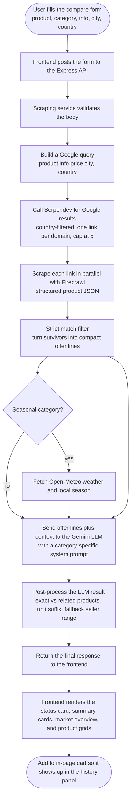

# Price Compare — Feature Documentation

## 1. Overview

The **Price Compare** feature lets a user type a product name, pick a category, and (optionally) a city plus country, and get back a side-by-side view of prices, sellers, the lowest price for buyers, and a recommended price range for sellers. The whole flow is built around a small backend that does the actual web scraping, and a frontend that calls it directly.

The system is split into two logical parts:

- **Scraping service** — A standalone Node.js + Express + TypeScript service (deployed on Vercel) that exposes a single public API and does the heavy lifting: search, scrape, and LLM analysis.
- **Frontend page** — The Next.js page that renders the UI, holds the state, and is composed of several small presentational components. It calls the scraping service through a thin client wrapper.

The frontend talks to the scraping service over a single endpoint on the Express app. The Express app owns the entire search, scrape, and analyse pipeline and returns a final JSON response.

---

## 2. How the Feature Is Used

### 2.1 What the user provides

The user fills a form with the following fields:

- **Product name** (required) — a free text field, for example *Aarong Full Cream Milk Powder 1kg*.
- **Category** (required) — a dropdown with 28 predefined options such as *groceries*, *electronics*, *clothing*, *home appliances*, and so on.
- **Info** (optional) — a small variant description, for example *1 kg pouch* or *256 GB Blue*.
- **City** (optional) — used for localising the search and, for some categories, the weather context.
- **Country** (required) — a human-readable full name like *Bangladesh* or *United States*. The UI presents it as a custom selector with a flag image.

These fields are sent in the request body as JSON to the scraping service.

### 2.2 Request flow

1. The user submits the form and the page builds a payload with the form values.
2. The page calls a small client wrapper that posts the body to the Express API.
3. The Express service runs the full pipeline (search → scrape → LLM analysis) and returns a single final JSON response.
4. The page applies the response to the on-screen state and renders the summary, market overview, and product grids.
5. The full result is also added to the in-page cart so the user can reopen it later from the history panel.

---

## 3. Scraping Service Pipeline

The scraping service is a small Express + TypeScript app. The full path for one request is:

> validate body → build search query → search Google links → scrape pages in parallel → condense scraped data → analyze prices with an LLM → sanitise and respond

### 3.1 Query Builder

This stage takes the user request and turns it into a single Google query. The shape of the query is essentially:

> *product name* *optional info* *price* *city, country*

For example: *Aarong Full Cream Milk Powder 1kg price Dhaka, Bangladesh*.

An important detail is that the builder intentionally avoids words like *compare* or *cheap*. The goal is to surface real product pages; the comparison itself is done downstream.

### 3.2 Google Search via Serper

The service then calls the Serper.dev Google Search API:

- **Endpoint** — a public Google Search proxy hosted by Serper.
- **Method** — POST.
- **Auth** — an API key sent in a custom header.
- **Body** — the query, a result count cap, and a country-level geolocation hint.

How the country is used:

- A built-in mapping converts the country name (e.g. *Bangladesh*) into a 2-letter country code (*bd*).
- That code is sent as the geolocation hint to Serper.
- After the results come back, every result's hostname is checked against the allowed country code, and any non-matching link is filtered out. This keeps results local.
- A small blocklist removes obvious non-product domains (Google, YouTube, Facebook, Wikipedia, Reddit, etc.).
- Only one link per unique domain is kept, capped at five links.

The output is a deduplicated, country-filtered list of product page URLs.

### 3.3 Web Scraping via Firecrawl

For each of the up to five URLs, the service calls Firecrawl to extract structured product data.

- **Endpoint** — Firecrawl's structured scrape endpoint.
- **Auth** — a bearer token in the Authorization header.
- **Body fields used** — the URL, a request for *extract* format, a flag to only return main content, an ad-block flag, a proxy mode, a long timeout, and a Firecrawl *extract* block with a custom prompt and a strict JSON schema.

How Firecrawl is used:

- The extract format is set so Firecrawl returns structured JSON rather than raw HTML or markdown.
- The extract block includes a prompt that tells Firecrawl's LLM what to pull (for example: *extract ALL products visible on this page, return price as a plain number, never invent values, normalise units*).
- It also includes a strict JSON schema that defines fields like product name, brand, product URL, image URL, availability, currency, price, original price, discount, unit text, unit value, and unit name. Extra fields are forbidden.
- The service normalises the response: relative URLs become absolute, currency defaults to a sensible fallback, availability is mapped to a fixed enum, and numeric prices are parsed carefully.
- All URLs are scraped in parallel so the whole search finishes in a single round trip.

Site metadata (favicon, page title, and Open Graph image) is also captured and attached to each scraped page so the UI can show logos and small touches.

### 3.4 Data Preprocessor

Firecrawl's raw product list is then cleaned and condensed.

- For every scraped page, products are converted to a normalised product record with fields like price, currency, unit, unit price, source, logo, and a match percentage.
- A **strict match filter** keeps only products whose name tokenises well against the user's input. The rules are:
  - All numeric tokens (model numbers like *17* or *256*) must match exactly — this prevents *"iPhone 17"* from matching *"iPhone 18"*.
  - Non-numeric tokens need at least 50% overlap (or 100% for very short queries).
  - If the user filled the optional info field, at least one of those tokens must also match.
- A **match percentage** between 40 and 100 is calculated: a base score from token overlap, plus a small boost if info tokens also match.
- The remaining products are turned into compact one-line offer strings of the form *product | price currency | unit*. These are the only thing the LLM sees.
- There is a hard character cap on the LLM input — if the offers exceed it, the rest is dropped.
- If no products pass the strict filter, the first few products from the scrape are kept as a fallback so the user still gets something to look at.

### 3.5 LLM Analyzer

This is the brain of the feature. It takes the compact offer lines and produces the pricing guidance shown to the user.

- **LLM provider** — the service uses the **Gemini API** for all pricing analysis. Calls are made with a very low temperature and a forced JSON response format for stable, deterministic output.
- The LLM is given a **category-aware system prompt** and a **structured user prompt**.

#### Category-aware prompts

There are **28 product categories**, each with its own system prompt. A generic fallback is used for anything else. Some examples of how the prompts differ:

- *Groceries* — focused on cut/prep, freshness, unit normalisation, and channel effects. This category is seasonal-sensitive.
- *Electronics* — focused on specs, warranty, import status. Not seasonal-sensitive.
- *Raw materials* — focused on grade, bulk sizing, per-unit normalisation. Seasonal-sensitive.
- *Clothing* — focused on material, brand tier, seasonal markdowns. Seasonal-sensitive.
- *Home appliances* — focused on capacity, energy, warranty. Seasonal-sensitive.
- *Beauty and personal care* — focused on authenticity, size normalisation.
- *Health and pharmacy* — focused on dosage, pack size, per-unit.
- *Baby and kids* — focused on safety, size, per-unit.
- *Books and stationery* — focused on edition, bundle, academic season. Seasonal-sensitive.
- *Sports and outdoors* — focused on material, season and event spikes. Seasonal-sensitive.
- *Tools and hardware* — focused on durability, brand, set vs single.
- *Automotive* — focused on compatibility, OEM vs aftermarket.
- *Furniture and home* — focused on material, size, delivery.
- *Pet supplies* — focused on nutrition, size, brand trust.
- *Office supplies* — focused on pack size, B2B bulk.
- *Services* — focused on duration, scope, quality tier.
- *Electronics accessories* — focused on compatibility, OEM vs third-party.
- *Mobiles and computing* — focused on specs, variant, warranty, region lock.
- *Kitchen and dining* — focused on material, set count, durability.
- *Gifts and crafts* — focused on customization, festivals, seasonal. Seasonal-sensitive.
- *Travel and luggage* — focused on size, durability, brand. Seasonal-sensitive.
- *Garden and farm* — focused on pack size, planting season. Seasonal-sensitive.
- *Toys and games* — focused on age range, safety, licensing. Seasonal-sensitive.
- *Jewelry and watches* — focused on material, purity, authenticity. Seasonal-sensitive.
- *Music instruments* — focused on brand, condition, accessories.
- *Industrial equipment* — focused on capacity, service contracts.
- *Software and digital* — focused on licensing, seats, compliance.
- *Education and training* — focused on duration, certification, per-hour pricing. Seasonal-sensitive.

The full system prompt wraps the category prompt with strict rules:

- The LLM is told to only output valid JSON with exactly four keys: *seller price*, *best price*, *summary*, and *seller summary*.
- *Seller price* is always a range in the form *MIN-MAX CURRENCY* or *MIN-MAX CURRENCY/UNIT*.
- *Best price* is the lowest offer with the same unit.
- *Summary* (a few sentences) covers product overview, price distribution, market clustering, units, and, for seasonal categories, seasonal and weather factors.
- *Seller summary* (a few sentences) covers pricing strategy (fast sale vs premium), profit-versus-speed tradeoff, market positioning, and risk factors.
- **Fixed-price categories** (electronics, mobiles, appliances, pharmacy, books, branded goods) keep the seller price at or above the credible market price with a narrow band.
- **Variable-price categories** (groceries, raw materials, garden, clothing, gifts) allow a sharper floor and a 75th-percentile cap.
- If the category is seasonal-sensitive, the prompt also includes live **weather** and **season** context (see below). If not, the LLM is explicitly told to ignore weather and season.

#### Weather and season enrichment

For seasonal-sensitive categories, the service:

- Calls the **Open-Meteo geocoding and forecast API** to get the current temperature and conditions for the user's city and country.
- Computes the current **season** (*winter*, *spring*, *summer*, *autumn*) from the latitude and the current UTC month, using meteorological seasons and flipping the southern hemisphere.
- Injects this context into the user prompt so the LLM can reason about things like *winter is coming, AC prices usually drop*.

The LLM still never invents numbers — it uses these signals only as a soft adjustment on top of the offers it already saw.

#### Post-processing of the LLM output

The LLM's JSON is validated against a schema, then post-processed:

- Products are split into **exact matches** (every original word present in the product name) and **related products** (at least one word present).
- The unit suffix is auto-detected (e.g. *per kg*, *per piece*, *per litre*) and appended to prices when needed.
- If the LLM did not produce a seller price, a deterministic fallback is computed from the offer list:
  - Median price plus best price for fixed-price categories.
  - 75th-percentile cap with a "fast sale" floor for variable-price categories.

The result is what the user sees in the UI.

---

## 4. Frontend

### 4.1 Stack and structure

- **Framework** — Next.js + React, all client-side.
- **State management** — A small context holds the response state and a cancellation reference. The page consumes it via a hook.
- **Animations** — A small animation library is used for fade-up sections and per-card entry animations.
- **Status card** — A pipeline status card shows the current stage, a progress indicator, the source count, and a collapsible list of the source URLs.
- **Icons** — The Lucide icon set.
- **Country flags** — A public flag image service, keyed by the country code from the country options list.

The page is composed of several focused components:

- A form component that handles the user input and submission.
- A status card that reflects the current stage, the progress, and a collapsible list of source URLs.
- A summary cards block that shows the best price, the recommended seller range, and the total products found.
- A market overview block that renders the buyer's summary and a highlighted seller guidance block.
- A product results block with two grids: exact matches and related products.
- A product card component for a single listing.
- A slide-over history panel for the user's saved comparisons.
- A small set of utility helpers for currency formatting, percentage colours, and stage colours.
- A type file that holds the shared TypeScript types plus the list of country and category options.

### 4.2 What the user sees

The page is a two-column layout, with the form on the left and the results on the right, and the form becomes sticky on wide screens.

1. **Header** — the page title.
2. **Compare form** — required product name, required category dropdown, optional info and variant, optional city, required country selector with flag. Includes a Cancel button and a Clear-form button.
3. **Status card** — shows the current stage (queued → searching → crawling → analysing → complete), a progress indicator, source count, query count, and a "View sources" accordion with the actual URLs.
4. **Summary cards** — three small cards showing the best price for buyers, the recommended seller range, and the total products found across all sources.
5. **Market overview** — the LLM's summary plus a highlighted seller guidance block.
6. **Exact matches** — a grid of product cards whose name contains every word of the user's input.
7. **Related products** — a grid of product cards that share at least one keyword.
8. **Product card** — shows product image (or fallback icon), source site and favicon, an availability pill, the product name, the formatted price, a colour-coded match percentage, the unit, the per-unit price when available, and a "View listing" button that opens the source product page in a new tab.
9. **History panel** — a slide-over drawer on the right showing the user's last five (or all) saved comparisons. Each entry shows product, category, country, and date. Clicking one reloads the form and rehydrates the result from the saved data.
10. **Saved comparisons** — if there are no live results yet, the main column shows the last five saved comparisons as quick-load buttons.

### 4.3 Save and history

- Every successful comparison is also added to the user's in-page cart, so the user can reopen it later from the history panel without leaving the session.

### 4.4 Backend-of-the-frontend connection

A small client module is the bridge between the React page and the network. It exposes a single call that posts the form payload to the Express API and returns the parsed result.

An abort signal can be passed in so the user can cancel the request mid-flight.

---

## 5. End-to-End Flow

1. The user opens the price-compare page, fills in the product, category, and (optionally) info, city, and country, and clicks **Compare prices**.
2. The frontend posts the body to the Express API on the scraping service.
3. The scraping service:
   1. Validates the body (product name, category, country are required).
   2. Builds a single Google query in the form *product info price city, country*.
   3. Calls Serper.dev for Google results, sends the country code as a geolocation hint, then filters to one unique-domain link per site (up to five), restricted to the chosen country.
   4. Calls Firecrawl in parallel on each link. Each Firecrawl call uses a custom extract prompt and a strict JSON schema, so the result is a clean set of structured products.
   5. Runs a strict-match filter on every product (numeric tokens must match exactly, non-numeric tokens need a threshold of overlap, and the optional info field is sanity-checked). The survivors are turned into compact one-line offer strings, capped at a fixed character limit.
   6. For seasonal categories, fetches the current weather from Open-Meteo and computes the local season.
   7. Sends the offer lines to the **Gemini** LLM with a category-specific system prompt. The LLM returns only *seller price*, *best price*, *summary*, and *seller summary*.
   8. Post-processes the result: splits products into exact and related, auto-detects the unit suffix, and computes a deterministic seller price fallback if the LLM missed it.
   9. Returns the final response.
4. The frontend applies the response to its state and renders the status card, the summary cards, the market overview, and the exact and related product grids.
5. The full result is also added to the in-page cart, so it shows up in the history panel for the rest of the session.

### 5.1 Workflow Diagram

The chart below shows the full end-to-end flow at a glance.

Key things to read off the chart:

- The form submission flows **Frontend → Express API** and back as a single round trip.
- Inside the scraping service, the only side branch is **weather**, which only runs for seasonal categories.
- The **LLM step** is a single Gemini call that turns the offer lines into pricing guidance.
- The final result is then **added to the in-page cart** for later reopening.

---

## 6. Step-by-Step Summary (Quick Read)

- The user types a product, picks a category, optionally adds info and a city, and chooses a country.
- The Next.js page sends this to the Express API on the scraping service.
- The scraping service builds a Google search query, calls Serper.dev, and gets back a country-filtered, deduplicated list of up to five product page URLs.
- It then calls Firecrawl in parallel on those URLs to extract clean, structured product data (name, price, currency, unit, image, availability, brand, discount, and so on).
- It runs a strict token-based match filter, drops anything that does not look like the user's product, and packs the survivors into compact one-line offer strings.
- For seasonal categories, it pulls current weather and season from Open-Meteo and feeds that into the LLM context.
- It sends the offer lines to the **Gemini** LLM with a category-specific system prompt. The LLM returns only a seller price range, a best price, a buyer summary, and a seller guidance summary.
- The result is post-processed, validated, split into exact and related products, and returned to the frontend.
- The frontend renders the status card, the summary cards, the market overview, and the exact and related product grids.
- The full result is also added to the in-page cart so it can be reopened from the history panel later.

