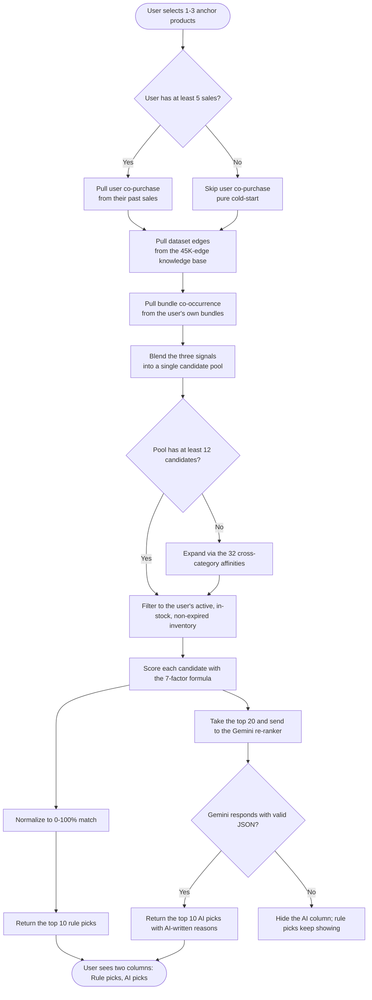

# Smart Basket — Product Recommendation System

## Quick Summary

Smart Basket recommends complementary products when a merchant picks 1–3 anchor items to build a bundle. The system blends the user's own sales history with a pre-built knowledge base of ~45,000 real co-purchase patterns from public retail datasets (Instacart + BundleRec), scores candidates with a 7-factor formula, and optionally re-ranks the top 20 with the Gemini API. Two pre-built tables power everything: **CoPurchaseEdge** stores 45K product-to-product relationships with category tags, and **CategoryAffinity** stores 32 cross-category pairing strengths — together they make the system work on day one for brand-new merchants with zero history.

---

## 1. Overview

The **Smart Basket** feature helps store owners and suppliers build higher-value product bundles. When a user selects 1–3 products to anchor a basket, the system suggests 10 more products to round it out — split across two columns: a **rule-based** list and an **AI re-ranked** list.

The system solves a hard problem: a new merchant on day one has zero sales, zero bundles, and no transaction history. Traditional recommendation systems (collaborative filtering, association rule mining) cannot work without that data. Smart Basket fixes this by combining the user's own sales history (when it exists) with a pre-built knowledge base of **~45,000 real retail co-purchase patterns** mined from two public datasets. The two signals are blended into a single score, and the top candidates are surfaced to the user.

Three layers, in order of dependency:

- **Knowledge base** — pre-computed co-purchase edges and category affinities, loaded from real public retail datasets.
- **Rule engine** — blends the user's own sales + bundle history with the knowledge base, applies a weighted scoring formula, and returns the top 10 candidates.
- **AI re-ranker** — optional layer that takes the top 20 rule candidates and asks a Gemini model to re-rank them with natural-language reasons.

The system is split into two logical parts:

- **Offline seed pipeline** — a one-time script that turns the two raw datasets into the knowledge base tables.
- **Runtime engine** — a server-side pipeline that takes the user's anchor products, blends three signals, applies the scoring formula, and produces the two suggestion columns.

---

## 2. How the Feature Is Used

### 2.1 The user flow

1. The user opens the basket creator and searches their own inventory.
2. They pick 1–3 anchor products. (Picking 3 is treated as "basket complete" and the suggestions pause.)
3. After a short debounce, the page calls the rule and AI endpoints in parallel and renders the two suggestion columns.
4. The user clicks **Add** on the suggestions they want — the basket fills up to the seed items plus whatever they added.
5. The user gives the basket a title, an optional description, a public toggle, and (optionally) saves it as a reusable bundle too.
6. The basket is persisted and the user is taken back to the list.

### 2.2 What the user sees

For each suggestion, the user sees a card with the product image, name, selling price, a match percentage, a short reason, and an **Add** button. The **Rule Picks** column is always present; the **AI Picks** column appears only when the AI layer succeeds.

### 2.3 The two pillars of every suggestion

- A **match percentage** (0–100%) that says how strongly the candidate is connected to the anchor products.
- A **short reason** in plain English. The rule engine produces reasons like *"Frequently bought together"*, *"Same category fit"*, *"Strong bundle match"*, or *"Great margin value"*. The AI produces short bespoke reasons like *"Classic breakfast combo"*.

---

## 3. The Two Recommendation Engines

### 3.1 Rule engine — always on

The rule engine is the primary recommendation layer. It is always available, even on a brand-new account with zero sales. It produces the **Rule Picks** column.

**Inputs:** the 1–3 anchor product IDs the user just selected.
**Output:** the top 10 candidate products (from the user's own inventory) with a 0–100% match score and a short reason.

The short version: the engine looks at (a) what else was bought alongside the anchor products in the user's past sales, (b) what the pre-built knowledge base says is commonly co-purchased in the same categories, (c) what else sits in the user's existing bundles, and blends all three signals into a single composite score.

The full scoring formula is in §7.

### 3.2 AI re-ranker — optional, parallel

The AI re-ranker is the **AI Picks** column. It runs **in parallel** with the rule engine and re-ranks the rule engine's top 20 candidates using the Gemini API.

**Inputs:** the same 1–3 anchor products, plus the top 20 rule candidates.
**Output:** the top 10 AI-re-ranked candidates with the same match percentage and reason format.

The AI is given a category-aware hint (e.g. for *Dairy* seeds it gets *"Focus on breakfast pairings and staples"*, for *Electronics* it gets *"Focus on compatible accessories and protection"*) and asked to return a strict JSON object with up to 10 picks. If the AI fails for any reason — no API key, network error, malformed JSON — the AI column simply does not render. The rule column keeps working normally.

---

## 4. The Knowledge Base

The rule engine is powered by two pre-built tables that sit in the same database as the rest of the app.

### 4.1 Co-purchase edges

A co-purchase edge is a single fact: *"products A and B were bought together N times in a real retail transaction, and they belong to categories X and Y."* The knowledge base holds **~45,000 of these rows** (15,000 from Instacart plus 10,000 from each of the three BundleRec domains), each annotated with its source dataset, its raw count, and a 0–1 score.

**What each row stores:**

| Field | What it stores |
|---|---|
| Product pair | Two dataset product IDs (e.g. *instacart_13176*, *instacart_47209*) |
| Frequency | Raw co-occurrence count from the source dataset |
| Score | Normalized 0–1 strength |
| Category of product A | The category the left product belongs to |
| Category of product B | The category the right product belongs to |
| Source dataset | Which dataset the edge came from (Instacart or BundleRec) |

**What the table does at runtime:** The edges are the primary source of co-purchase signal. When a merchant picks an anchor product, the engine queries the edges for every row where the anchor's category appears on either side, and uses the other side as a *suggested category*. The candidate pool is then filled with the user's own products in those suggested categories, with a small frequency boost that mirrors the edge's score. The two per-product category fields are the critical piece — they let the engine discover cross-category patterns like *dairy + produce* or *electronics + electronics* even though the product IDs in the dataset are completely different from the IDs in the user's inventory. The table is never joined to the user's own products by ID; it is always joined by category.

### 4.2 Category affinities

A category affinity is a single number expressing how strongly one category pairs with another, derived from the edges above. The knowledge base holds **32 of these rows** — every meaningful pair across the platform's 25-value category enum, including within-category pairs (a category paired with itself) and cross-category pairs.

**What each row stores:**

| Field | What it stores |
|---|---|
| Category A | The left-hand category (e.g. *DAIRY*) |
| Category B | The right-hand category (e.g. *FRESH_PRODUCE*) |
| Affinity score | A single 0–1 number expressing how strongly the two pair together |

**What the table does at runtime:** The affinity table is the cold-start fallback. If the candidate pool built from the edges has fewer than 12 candidates — usually because the merchant is brand new or has sparse inventory in the anchor's category — the engine reads this table for the top related categories of the anchor's category and pulls the user's own products from those related categories. This guarantees the recommendation panel is never empty on day one.

**How the score is computed.** For every pair of categories A and B, the pipeline aggregates the frequencies of all edges where A and B appear on the two sides, then divides by the geometric mean of the two category totals:

```
affinity(A, B) = pairFrequency / sqrt(totalA * totalB)
```

- `pairFrequency` is the total co-occurrence count across all edges joining the two categories.
- `totalA` and `totalB` are the total co-occurrence counts for each category on its own.
- The square-root normalization prevents high-volume categories from dominating — a category with 10,000 edges cannot inflate its pair scores purely on volume.
- The result is clamped to [0, 1].

A few real examples from the loaded table:

| Pair | Affinity | What it means |
|---|---|---|
| ELECTRONICS ↔ ELECTRONICS | 0.500 | Tight within-category electronics bundling (cables, accessories) |
| CLOTHING ↔ CLOTHING | 0.500 | Tight within-category clothing bundling |
| FRESH_PRODUCE ↔ FRESH_PRODUCE | 0.344 | Produce bought with produce (apples + bananas) |
| DAIRY ↔ FRESH_PRODUCE | 0.312 | Milk + produce — a grocery reality |
| FRESH_PRODUCE ↔ GROCERIES | 0.273 | Produce + pantry staples |
| FRESH_PRODUCE ↔ MEAT_POULTRY | 0.174 | Meat with vegetables (meal patterns) |
| GROCERIES ↔ GROCERIES | 0.136 | Pantry items together |
| DAIRY ↔ DAIRY | 0.103 | Dairy items together (milk + eggs) |
| CLOTHING ↔ STATIONERY | 0.015 | Weak cross-domain (apparel + office) |

---

## 5. Where the Knowledge Base Came From

The knowledge base is built **once, offline**, from two real public retail datasets. There is no synthetic data anywhere in the system.

### 5.1 The two datasets

| Dataset | Domain | Scale | What it gives us |
|---|---|---|---|
| **Instacart Market Basket** | Grocery | 50,000 products, ~200,000 sampled orders (577 MB of raw transaction lines) | Inferred co-purchase patterns from real grocery shopping baskets |
| **BundleRec** | Food, clothing, electronics | ~1,800 bundles per domain across 3 domains, plus 12,000 real product names | Explicit "these items belong together" signals from Amazon bundle reviews, plus per-session co-occurrence |

**Why these two?** Instacart is the largest publicly available grocery transaction dataset, and its co-purchase patterns (milk with cereal, produce with meat) transfer well to any B2B grocery context. BundleRec covers two non-grocery domains (clothing, electronics) that Instacart does not, and gives **explicit** bundle intent — a stronger signal than inferred co-purchase. Together they cover the three main domains the platform serves.

### 5.2 The seed pipeline

The pipeline runs as a single offline script and produces the snapshot that gets loaded into the database. It has four phases:

**Phase 1 — Instacart.** The reference tables (departments, aisles, products) are loaded first to build a category map. Then the 577 MB order file is **streamed line-by-line** (never loaded fully into memory) using Node.js streams. Up to 200,000 orders are sampled, and for every order, every unique pair of products is counted. The top 15,000 pairs by frequency are kept as edges. Each edge stores the resolved category for both products.

**Phase 2 — BundleRec.** For each of the three domains (food, clothing, electronic), the bundle table and the session table are parsed. Bundle membership is a strong "goes together" signal (weighted ×3); session co-occurrence is a weaker signal (weighted ×1). Per domain, the top 10,000 edges are kept. Product names and category strings (Amazon's nested format) are parsed and mapped to the platform's 25-value category enum.

**Phase 3 — Aggregation.** Edges from all sources are merged with weights: Instacart 50%, BundleRec food 30%, BundleRec clothing 10%, BundleRec electronic 10%. Per-product category fields let the pipeline compute the 32 cross-category affinities in a single pass.

**Phase 4 — Database upsert.** The aggregated edges and affinities are written to the database in batches. A JSON snapshot is also saved to disk so the pipeline can be re-run quickly without re-processing the raw files.

### 5.3 The "no product ID collision" trick

The two datasets use completely different product IDs from each other *and* from the user's own inventory. To avoid any chance of collision, every dataset product ID is prefixed with its source — `instacart_13176`, `bundlerec_food_5562`, `bundlerec_clothing_43086`, `bundlerec_electronic_111245`. Collisions become structurally impossible, and the engine never confuses a dataset product with a real user product.

### 5.4 Why a snapshot?

The pipeline takes 4–7 minutes on a cold run (mostly the Instacart streaming pass and the database upserts). On the next run, the cached JSON snapshot loads in under a second and the pipeline only re-does the database upsert step — about 2 minutes. Delete the snapshot to force a full re-process from the raw files.

---

## 6. How the Knowledge Base Is Used at Runtime

### 6.1 The category-level bridge

This is the most important design idea in the system. Dataset product IDs are synthetic — they are not in the user's inventory. So the engine never tries to match a dataset product to a user product directly. Instead, it matches **at the category level**:

1. The user selects an anchor product. The system reads its category (e.g. *DAIRY*).
2. The system pulls the co-purchase edges whose category A or B is *DAIRY*. These edges encode patterns like *"DAIRY products often co-purchase with FRESH_PRODUCE, GROCERIES, MEAT_POULTRY"*.
3. For each related category, the system finds the user's own products in that category and gives them a frequency boost.
4. The user's own inventory is what gets returned as candidates — never the dataset products themselves.

This works because retail co-purchase patterns are a category-level phenomenon: bananas and milk go together regardless of the brand or SKU.

### 6.2 The candidate pool

For a given set of 1–3 anchor products, the engine builds a candidate pool from three sources and blends their scores:

- **User sales** — every product that has ever been bought alongside an anchor product in the user's own past sales. Weight ×0.6 when blended.
- **Dataset edges** — every category-related product surfaced by the knowledge base. Weight ×0.4 when blended; weight ×1.0 when the user has fewer than 5 sales (cold start).
- **User bundles** — every product that has ever been bundled with an anchor product in the user's own past bundles.

The **5-sale threshold** is the cold-start switch. Below it, the user sales source is skipped entirely and the dataset provides 100% of the co-purchase signal. This is what makes the system work on day one.

### 6.3 The category affinity fallback

If the blended pool has fewer than 12 candidates, the system expands it by pulling the user's own products from related categories — using the 32 cross-category affinities in the knowledge base. For example, if the user selected a *GROCERIES* anchor but has few groceries in inventory, the system will also pull products from *DAIRY* and *HOME_APPLIANCE* (the top related categories) to keep the recommendation panel from being empty.

---

## 7. The Scoring Formula

Every candidate that survives the inventory filters (active, in stock, not expired, not already in the basket) is scored with a single composite formula. The final score is the sum of seven factors, each with its own weight and rationale.

### 7.1 The formula

```
finalScore = coPurchase       × 3.0
           + bundleCount      × 2.0
           + sameCategory     × 1.2
           + marginStrength   × 1.1
           + stockLevel       × 0.7
           + pricePreference  (varies by buyingPriority)
           − 0.6              if the product is expiring within 7 days
```

The co-purchase term itself is a blend:

```
coPurchase = userSales       × 0.6   +   datasetEdges × 0.4    (if ≥ 5 sales)
coPurchase = datasetEdges    × 1.0                              (cold start, < 5 sales)
```

### 7.2 Each factor in detail

**Co-purchase frequency (×3) — the primary signal.** This is the blended count of how often the candidate was bought together with the anchor products. The blend is the only place the cold-start switch lives.

**Bundle co-occurrence (×2).** A simple count of how many of the user's existing bundles contain both the anchor product and this candidate. A bundle the user themselves created is a strong "goes together" signal.

**Same-category bonus (×1.2).** A flat 1.2 if the candidate's category matches any anchor's category, 0 otherwise. Within-category recommendations get a small nudge.

**Margin strength (×1.1).** Normalized to 0–1: `(sellingPrice − costPrice) / sellingPrice`. The platform is seller-centric, so high-margin products get a small boost.

**Stock level (×0.7).** Normalized to 0–1: `quantity / 20` (so 20+ units in stock scores 1.0). Well-stocked items are preferred because they can actually be added to a basket.

**Price preference (variable).** Driven by the user's own *buying priority* setting from their profile:

- *Low cost* → lower-priced candidates score higher (inverse normalization against the max price in the candidate set)
- *Quality* → higher-priced candidates score higher
- *Fast* / *Reliability* / *Consistency* → no price adjustment, rely on stock and category fit instead

**Expiry penalty (−0.6).** A flat penalty if the candidate's expiry date is within 7 days. Applied additively so it doesn't disproportionately punish a product that has very high co-purchase scores for other reasons.

### 7.3 Final normalization

The raw scores are normalized to a 0–100% match percentage for the UI:

```
matchPercent = round((candidateScore / topScore) × 100)
```

The top candidate always shows 100%, giving a relative ranking rather than an absolute quality number.

### 7.4 A worked example

A user with 12 sales selects **Organic Whole Milk** (DAIRY). One candidate is **Bananas** (FRESH_PRODUCE). The system computes:

| Factor | Value | × Weight | Contribution |
|---|---|---|---|
| Co-purchase (8 user + 4,200 dataset) | 1,684.8 | × 3.0 | 5,054.4 |
| Bundle co-occurrence | 0 | × 2.0 | 0.0 |
| Same-category bonus | 0 (DAIRY ≠ FRESH_PRODUCE) | × 1.2 | 0.0 |
| Margin strength (35% margin) | 0.35 | × 1.1 | 0.385 |
| Stock level (12 units) | 0.6 | × 0.7 | 0.42 |
| Price preference (user = *Low cost*) | 0.4 | — | 0.4 |
| Expiry penalty (bananas good for 14 days) | 0 | — | 0.0 |
| **Total** | | | **5,055.6** |

If the top candidate in the same set scored 5,500, the UI shows Bananas at `round(5055.6 / 5500 × 100) = 92%`.

---

## 8. The AI Re-Ranker (in more detail)

The rule engine produces 20 candidates. The AI re-ranker takes those 20 and re-ranks them with the Gemini API.

### 8.1 What the model sees

The model gets a short JSON-shaped prompt with:

- The selected anchor products — name, category, rounded price.
- The 20 candidate products — id, name, category, rounded price, current match percent.
- A **category-aware hint** that nudges the model toward the right kind of pairing for the anchor's category. Examples: *DAIRY* gets *"Focus on breakfast pairings and staples"*, *ELECTRONICS* gets *"Focus on compatible accessories and protection"*, *CLOTHING* gets *"Focus on matching essentials and care items"*. There is a hint for every one of the 25 categories; a generic fallback is used if the category is unknown.
- Strict instructions: return a JSON object with a `picks` array, each pick has an `id`, a `reason` (≤ 8 words), and a `matchScore` (0–100). No extra keys, no markdown.

### 8.2 How the response is used

The picks are mapped back to the user's product records. The AI's `matchScore` replaces the rule-engine's match percent; the AI's `reason` replaces the rule-engine's reason text. The AI picks are then sorted, capped at 10, and rendered in the **AI Picks** column.

### 8.3 What happens when the AI fails

- No API key configured → AI endpoint returns an empty list, the column does not render.
- Network error or timeout → same fallback.
- Malformed JSON → same fallback.
- Partial response (< 10 picks) → renders whatever came back.

In every failure case, the rule column keeps working. The system is never blocked by the AI.

---

## 9. End-to-End Flow



Key things to read off the chart:

- The whole pipeline runs **server-side**; the browser just calls two endpoints in parallel and renders the two columns.
- The **5-sale threshold** is the only branch that decides whether the user's own sales data is blended in or whether the dataset provides 100% of the signal.
- The **knowledge base** (45K edges + 32 affinities) is the cold-start insurance — it means the system works on day one, before the user has any history.
- The **AI step is optional and isolated** — its success or failure has zero impact on the rule column.

---

## 10. Edge Cases & Safeguards

| Situation | What happens |
|---|---|
| Brand-new user, 0 sales | The dataset provides 100% of the co-purchase signal. The user still gets meaningful suggestions from day one. |
| Sparse inventory (< 12 candidates) | The 32 cross-category affinities expand the pool by pulling products from related categories. The recommendation panel is never empty. |
| 3 anchor products selected | The basket is considered complete. Suggestions pause; the UI tells the user to remove one if they want more suggestions. |
| AI service down / no key / bad JSON | The rule column keeps working. The AI column is simply not rendered. |
| Near-expiry candidate (within 7 days) | A flat −0.6 is added to the candidate's score. Additive, not multiplicative, so very strong co-purchase signals can still surface a near-expiry product. |
| Duplicate selection | Silently ignored — the product is not added twice. |
| Product belongs to another user | The save action refuses it with a "missing products" error. |
| Pipeline crash mid-write | Snapshot writes are atomic: a temp file is renamed only on full success, so a partial snapshot never overwrites a good one. |

---

## 11. Step-by-Step Summary (Quick Read)

- **Smart Basket** is a hybrid product recommendation system that helps merchants build bundles. The user picks 1–3 anchor products; the system suggests 10 more.
- The recommendations come from two columns: a **rule-based** list (always on) and an **AI re-ranked** list (optional, uses the Gemini API).
- The rule engine is powered by a pre-built knowledge base of **~45,000 real co-purchase edges** and **32 cross-category affinities** mined from two public retail datasets.
- The two datasets are **Instacart** (real grocery transactions) and **BundleRec** (explicit Amazon bundles across food, clothing, electronics). They were chosen to cover the platform's three main domains.
- The knowledge base is built **once, offline** by a streaming pipeline that never loads the 577 MB Instacart file fully into memory. A cached JSON snapshot makes re-runs fast.
- At runtime, the rule engine **matches by category, not by product ID** — dataset product IDs are synthetic and never collide with the user's own products, but they share a category vocabulary.
- Three signals are blended: **user sales** (60% when the user has ≥ 5 sales), **dataset edges** (40% or 100% cold-start), and **user bundles**. The blend is what makes the system work for both new and established merchants.
- A **7-factor composite score** ranks the candidates: co-purchase frequency (×3), bundle co-occurrence (×2), same-category bonus (×1.2), margin strength (×1.1), stock level (×0.7), price preference (varies by buying priority), and an expiry penalty (−0.6).
- The top 20 rule candidates are optionally re-ranked by a **Gemini model** with a category-aware hint. The result is 10 picks with short, human-readable reasons. The AI never blocks the rule column.
- The whole flow — selecting anchors, fetching suggestions, adding to basket, saving — runs in under a second on a warm cache, and the recommendation panel is never empty thanks to the cold-start design and the category affinity fallback.
